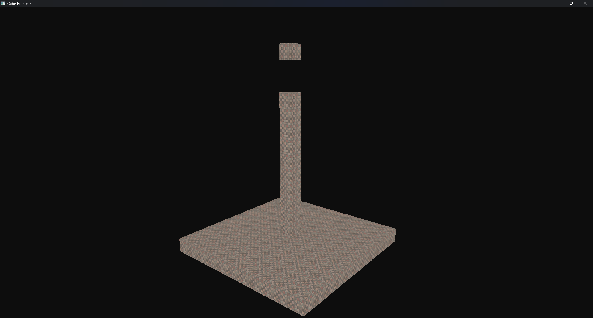
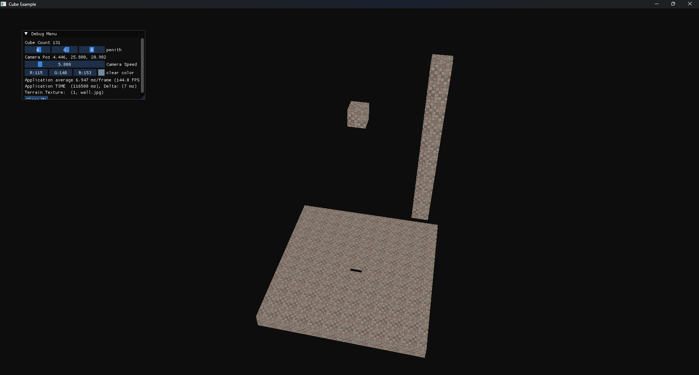
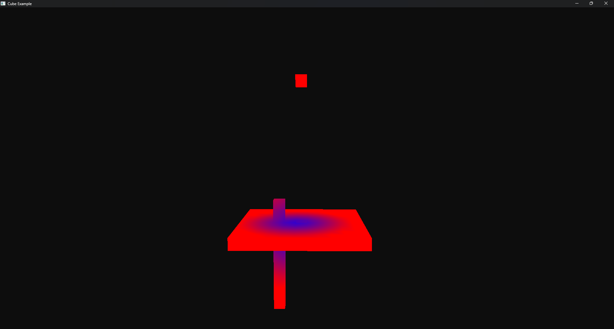

# SDL3PRJ
A Simple 3D Application Using SDL3 and OpenGL to Draw voxels to the screen

## Dependencies
### General 
* Ensure Python is installed and added to PATH to compile some dependencies
* Ensure you have CMake min version 3.22
### Windows
* Ensure your graphics drivers support a recent version of OpenGL

### Linux
* Ensure OpenGL is installed for your system (if your using linux, you can figure it out.)
  * For Ubuntu: sudo apt install libgl1-mesa-dev libglu1-mesa-dev freeglut3-dev

Other than that, it should install and download all other dependencies when cmake is run

## Installation Guide
* Use either CLion or Visual Studio to compile (They have both been tested and should work)
* Ensure that Ninja Build is installed in your build toolchain
* Compiling with cmake should also work, however it fails to copy some dll files (Put them in with the compiled binary and it should work)
	* Compile with CMake: (This command is untested)
	* cmake -G Ninja -DCMAKE_C_COMPILER=gcc -DCMAKE_CXX_COMPILER=g++ .. 