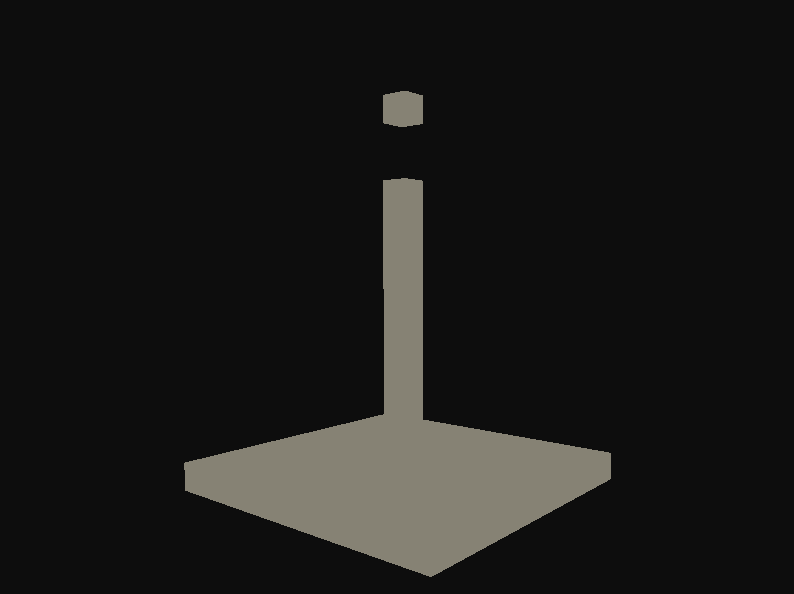

# SDL3PRJ
A Simple 3D Application Using SDL3 and OpenGL to Draw voxels to the screen

Ensure Python is installed and added to PATH to compile some dependencies

Other than that, it should install and download all other dependencies when cmake is run