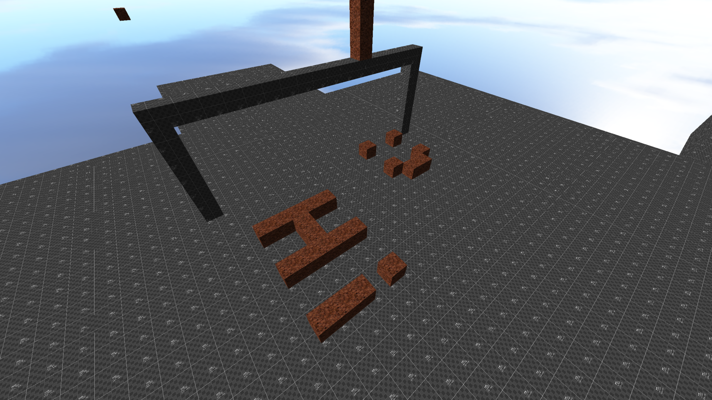
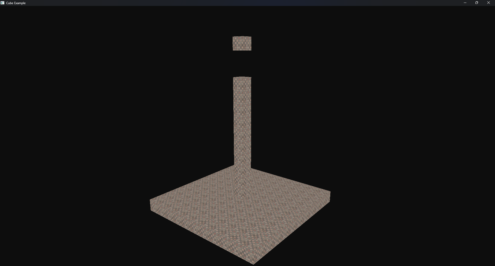
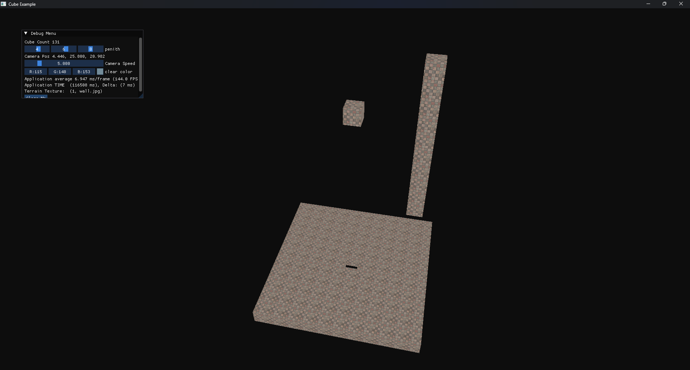
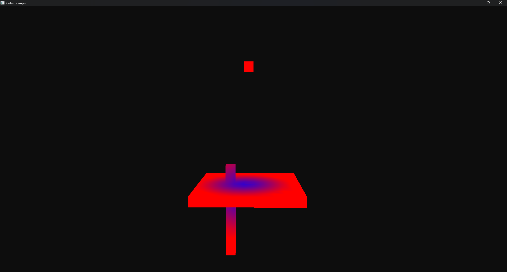

# Voxel Engine

## About
A simple 3D application using modern graphics technologies to draw voxels to the screen.

This project generates voxel terrain by taking advantage of greedy meshing algorithms and is written in C++.
It uses libraries such as SDL3, OpenGL, Vulkan and ImGUI keeping the project portable and compilable on many operating systems.

## Dependencies
### Windows
* Python 3.14
* cmake
  * Ensure you have CMake min version 3.28
* ninja-build
* Ensure your graphics drivers support a recent version of OpenGL

### Ubuntu
required apt packages to build:
* git
* cmake
    * Ensure you have CMake min version 3.28
* ninja-build
build-essentials
autoconf autoconf-archive automake libtool
python3.14-venv
mesa-common-dev libgl1-mesa-dev libglu1-mesa-dev

Other than that, vcpkg should install and download all other dependencies when cmake is run

## Installation Guide
### Recommended setup
* Load the Cmake project in either CLion or Visual Studio to compile
* Ensure that vcpkg and Ninja Build is installed and used in your build toolchain

### Cmake
* Otherwise, compiling with cmake should also work, however it fails to copy some dll files (Put them in with the compiled binary and it should work)
	
#### Ubuntu
#### in the project root directory, run as shown below:
    ~/../Voxel-Engine$ sudo cmake -B build -G Ninja -DCMAKE_C_COMPILER=gcc -DCMAKE_CXX_COMPILER=g++ -DCMAKE_MAKE_PROGRAM=/usr/bin/ninja -DCMAKE_TOOLCHAIN_FILE=$VCPKG_ROOT/scripts/buildsystems/vcpkg.cmake
    ~/../Voxel-Engine$ cmake --build build

## Early Development Images

